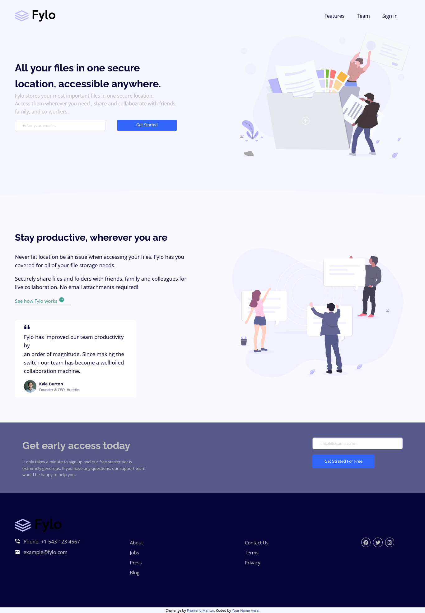

# Frontend Mentor - Fylo landing page with two column layout solution

This is a solution to the [Fylo landing page with two column layout challenge on Frontend Mentor](https://www.frontendmentor.io/challenges/fylo-landing-page-with-two-column-layout-5ca5ef041e82137ec91a50f5). Frontend Mentor challenges help you improve your coding skills by building realistic projects. 

## Table of contents

- [Overview](#overview)
  - [The challenge](#the-challenge)
  - [Screenshot](#screenshot)
  - [Links](#links)
  - [Built with](#built-with)
  - [What I learned](#what-i-learned)
  - [Continued development](#continued-development)
- [Author](#author)


## Overview

### The challenge

Users should be able to:

- View the optimal layout for the site depending on their device's screen size
- See hover states for all interactive elements on the page

### Screenshot



### Links

- Solution URL: [Add solution URL here](https://github.com/jhustice/Challenge-3)
- Live Site URL: [Add live site URL here](https://eloquent-cuchufli-a48e29.netlify.app/)

### Built with

- Semantic HTML5 markup
- CSS custom properties
- Flexbox
- CSS Grid

### What I learned

In flexbox changing position of two items or element is easy. But with CSS grid it's kinda complicated i learnt how to do it with CSS grid on this project.

To see how you can add code snippets, see below:

```css
.proud-of-this-css {
  order: 1;
}
```

### Continued development

I'll just say the grid i know it pretty well. But i think i'll have to develop there in future projects.

## Author

- Frontend Mentor - [@jhustice](https://www.frontendmentor.io/profile/jhustice)
- Twitter - [@_jhustice](https://www.twitter.com/_jhustice)

